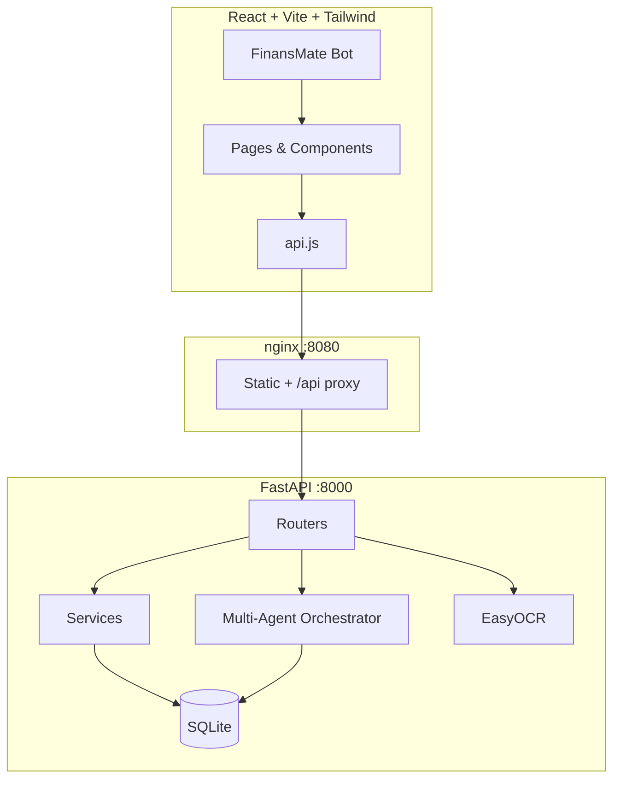
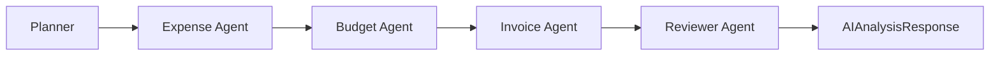

# AileFinans — AI-Powered Family Budget Management System

[](https://fastapi.tiangolo.com)
[](https://react.dev)
[](https://docker.com)
[](backend/tests)

Aileler için gelir, gider ve fatura takibi; multi-agent AI bütçe analizi; EasyOCR ile fatura fotoğrafından otomatik okuma (Zor Mod).

---

## İçindekiler

- [Özellikler](#özellikler)
- [Hızlı Başlangıç](#hızlı-başlangıç)
- [Mimari](#mimari)
- [SOLID Prensipleri](#solid-prensipleri)
- [Design Pattern'ler](#design-patternler)
- [Teknoloji Yığını](#teknoloji-yığını)
- [Proje Yapısı](#proje-yapısı)
- [Dokümantasyon](#dokümantasyon)
- [Testler](#testler)
- [Demo Hesap](#demo-hesap)
- [Lisans ve Teslim](#lisans-ve-teslim)

---

## Özellikler

| Modül | Açıklama |
|-------|----------|
| **Kimlik doğrulama** | JWT + bcrypt + matematik captcha |
| **Gelir / Gider** | CRUD, kategori, arama, filtre |
| **Faturalar** | CRUD, KDV, sözleşme takibi, `.ics` hatırlatıcı |
| **OCR (Zor Mod)** | EasyOCR ile tutar/tarih/kurum okuma |
| **FinansKoç AI** | 5 ajanlı multi-agent bütçe analizi |
| **Aile bütçesi** | Gelir havuzu, üye katkıları |
| **Tasarruf hedefleri** | Goal Coach kişisel mesajlar |
| **FinansMate** | Kural tabanlı sohbet asistanı |
| **Raporlama** | Dashboard KPI, grafikler, CSV/PDF export |
| **Docker** | Tek komutla tam stack |

---

## Hızlı Başlangıç

### Docker (Önerilen — jüri / demo)

```bash
docker compose up --build
```

| URL | Açıklama |
|-----|----------|
| http://localhost:8080 | Uygulama |
| http://localhost:8000/docs | Swagger API |

### Manuel (Geliştirici)

```bash
# Backend
cd backend && python -m venv venv && venv\Scripts\activate
pip install -r requirements.txt
uvicorn app.main:app --reload

# Frontend
cd frontend && npm install && npm run dev
```

Frontend: http://localhost:5173 · Backend: http://127.0.0.1:8000

---

## Mimari

Katmanlı **client-server** mimarisi: React SPA → nginx (Docker) → FastAPI → SQLite.



### Multi-Agent Pipeline



Detaylı mimari, ER diyagramı ve API sözleşmesi: **[docs/TEKNIK.md](docs/TEKNIK.md)**

---

## SOLID Prensipleri

| Prensip | Uygulama | Örnek |
|---------|----------|-------|
| **S** — Single Responsibility | Her modül tek iş | `captcha.py` yalnızca captcha; `ocr_service.py` yalnızca OCR |
| **O** — Open/Closed | Genişlemeye açık, değişime kapalı | Yeni router `main.py`'de eklenir; mevcut kod değişmez |
| **L** — Liskov Substitution | Test ortamında DB değiştirilebilir | `get_db` override → in-memory SQLite |
| **I** — Interface Segregation | İnce API sözleşmeleri | `IncomeCreate` / `IncomeUpdate` / `IncomeResponse` ayrımı |
| **D** — Dependency Inversion | Soyut bağımlılıklar | Router'lar `Depends(get_db)`, `Depends(get_current_user)` kullanır |

---

## Design Pattern'ler

| Pattern | Konum | Amaç |
|---------|-------|------|
| **Layered Architecture** | backend/app | Presentation → Router → Service → Data |
| **Dependency Injection** | FastAPI `Depends()` | DB session, auth enjeksiyonu |
| **Orchestrator** | `services/agents/orchestrator.py` | Multi-agent koordinasyonu |
| **Strategy** | `services/agents/analysis.py` | Her ajan farklı analiz algoritması |
| **DTO / Schema** | `schemas.py` | API ↔ domain ayrımı (Pydantic) |
| **Facade** | `frontend/src/api.js` | Tek noktadan HTTP erişimi |
| **Repository (hafif)** | Router + SQLAlchemy | Entity CRUD sorguları |

---

## Teknoloji Yığını

| Katman | Teknoloji |
|--------|-----------|
| Frontend | React 19, React Router 7, Vite 6, Tailwind CSS, Recharts |
| Backend | FastAPI, Uvicorn, SQLAlchemy 2, Pydantic v2 |
| Veritabanı | SQLite 3 |
| Auth | JWT (python-jose), bcrypt |
| OCR | EasyOCR, OpenCV, PyTorch CPU |
| Test | pytest, FastAPI TestClient |
| DevOps | Docker Compose, nginx |

---

## Proje Yapısı

```
gtech-project/
├── docs/                       # 📄 Proje dokümantasyonu
│   ├── ANALIZ.md               # Problem, kapsam, user story, kabul kriterleri
│   ├── TEKNIK.md               # Mimari, veri modeli, API, AI kararları
│   ├── KILAVUZ.md              # Ekran bazlı kullanım kılavuzu
│   ├── AI-GUNLUGU.md           # AI geliştirme günlüğü
│   └── DEMO.md                 # Canlı demo senaryosu
├── docker-compose.yml
├── backend/
│   ├── app/
│   │   ├── main.py             # FastAPI entry, router registration
│   │   ├── models.py           # SQLAlchemy ORM
│   │   ├── schemas.py          # Pydantic DTO
│   │   ├── auth.py             # JWT + password hashing
│   │   ├── routers/            # HTTP endpoints (domain bazlı)
│   │   └── services/
│   │       ├── agents/         # Multi-agent AI
│   │       ├── ocr_service.py  # EasyOCR pipeline
│   │       └── goal_coach.py   # Tasarruf koçu
│   ├── tests/                  # pytest (17 test)
│   ├── database/               # budget.db
│   └── uploads/                # Fatura görselleri
└── frontend/
    └── src/
        ├── pages/              # Dashboard, Invoices, AI, Family, ...
        ├── components/         # Layout, ChatBot, Icons
        └── api.js              # HTTP client
```

---

## Dokümantasyon

| Dosya | İçerik |
|-------|--------|
| [docs/ANALIZ.md](docs/ANALIZ.md) | Problem tanımı, kapsam içi/dışı, kullanıcı hikâyeleri, kabul kriterleri |
| [docs/TEKNIK.md](docs/TEKNIK.md) | Mimari şema, ER diyagramı, API sözleşmesi, AI model kararları |
| [docs/KILAVUZ.md](docs/KILAVUZ.md) | Kurulum + ekran ekran kullanım |
| [docs/AI-GUNLUGU.md](docs/AI-GUNLUGU.md) | Cursor AI süreci, promptlar, insan düzeltmeleri |
| [docs/DEMO.md](docs/DEMO.md) | 5–10 dk demo script |

---

## Testler

```powershell
cd backend
pip install -r requirements-dev.txt
pytest
```

- **17 test** — captcha, auth API, CRUD, goal coach
- Bellek içi SQLite (`TESTING=1`)
- OCR ve demo seed test sırasında atlanır

---

## Demo Hesap

```
E-posta: sonay@sonay.com
Şifre:   demo123
```

Alternatif: `demo@demo.com / demo123`

Giriş ekranında matematik captcha çözülür (örnek: `7 + 4 = ?` → `11`).

Demo veriler (gelir, gider, fatura, aile üyeleri, hedefler) ilk startup'ta otomatik yüklenir.

---

## OCR Notu

İlk OCR kullanımında EasyOCR model dosyaları indirilebilir (~100MB). Docker imajında modeller build sırasında ön-indirilir. OCR isteği 30–90 saniye sürebilir.

---

## Docker Detayları

```bash
docker compose up --build -d    # arka plan
docker compose down             # durdur
docker compose down -v          # volume sil (DB sıfırla)
```

| Container | Port | Volume |
|-----------|------|--------|
| ailefinans-frontend | 8080 | — |
| ailefinans-backend | 8000 | backend-data, backend-uploads |

---

## API Özeti

Tüm endpoint'ler `/api` prefix'i altında. Auth: `Authorization: Bearer <JWT>`

| Grup | Endpoint'ler |
|------|--------------|
| Auth | `/auth/captcha`, `/auth/register`, `/auth/login`, `/auth/me` |
| CRUD | `/incomes`, `/expenses`, `/invoices` |
| Rapor | `/reports/monthly`, `/reports/stats`, `/reports/export`, `/reports/vat-summary` |
| AI | `/ai/analyze` |
| OCR | `/ocr/scan`, `/ocr/scan-and-create` |
| Aile | `/family`, `/goals`, `/settings` |

Tam sözleşme: **[docs/TEKNIK.md](docs/TEKNIK.md)** · Swagger: http://localhost:8000/docs

---

## Lisans ve Teslim

GTech dönem projesi — AI destekli geliştirme süreci [docs/AI-GUNLUGU.md](docs/AI-GUNLUGU.md) dosyasında belgelenmiştir.

**Teslim checklist:**
- [x] Analiz dokümanı
- [x] Teknik doküman (mimari, SOLID, pattern)
- [x] Kullanım kılavuzu
- [x] AI günlüğü
- [x] Demo kılavuzu
- [x] Docker tek komut
- [x] Backend testleri
- [x] GitHub README
