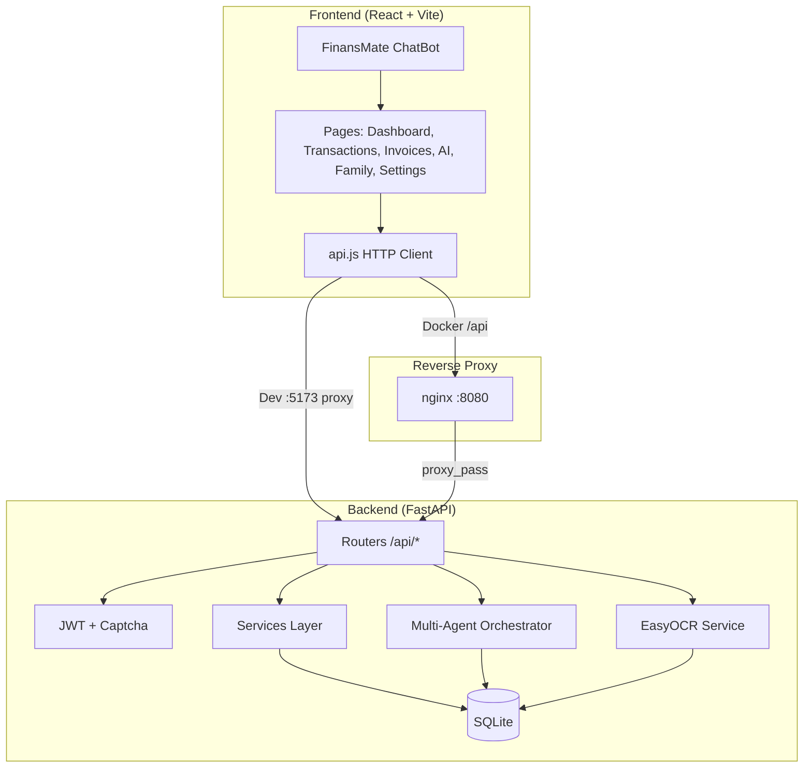
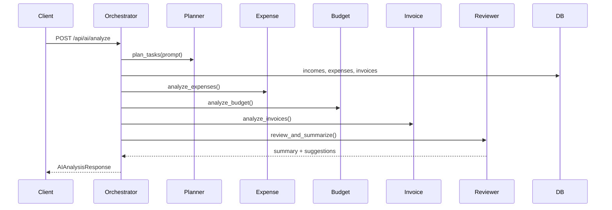
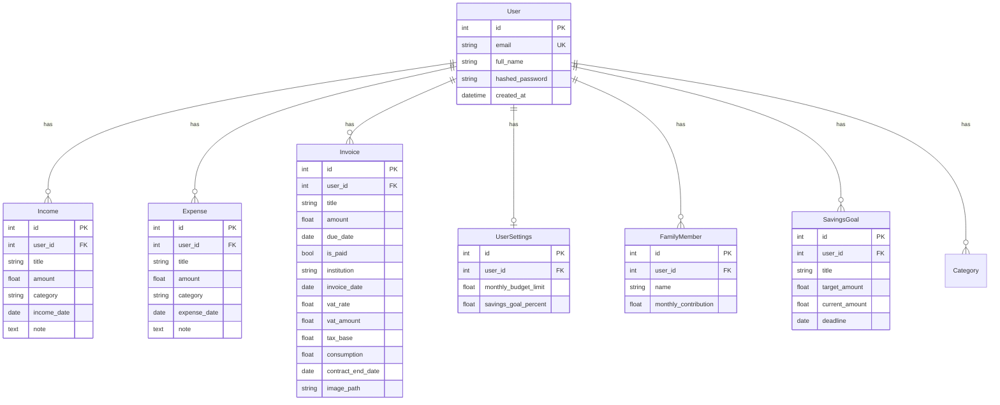
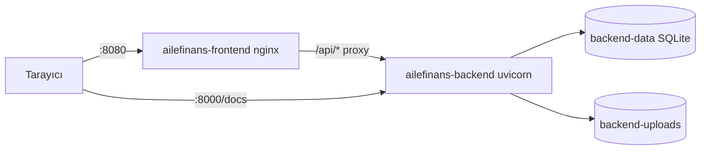

# Teknik Doküman — AileFinans

**Proje:** AI-Powered Family Budget Management System  
**Versiyon:** 1.0.0  
**Tarih:** Ağustos 2026

---

## 1. Mimari Genel Bakış

Uygulama **katmanlı mimari (Layered Architecture)** ve **client-server** modeli kullanır.



### 1.1 Teknoloji Yığını

| Katman | Teknoloji | Sürüm |
|--------|-----------|-------|
| Frontend | React, React Router, Vite, Tailwind CSS, Recharts | 19 / 7 / 6 |
| Backend | FastAPI, Uvicorn, SQLAlchemy, Pydantic | 0.115 / 2.x |
| Veritabanı | SQLite | 3.x |
| Auth | python-jose (JWT), bcrypt | HS256, 24h |
| OCR | EasyOCR, OpenCV, PyTorch (CPU) | tr+en |
| PDF Export | fpdf2 | — |
| Test | pytest, FastAPI TestClient | 8.3 |
| Container | Docker Compose, nginx alpine | — |

---

## 2. SOLID Prensipleri ve Uygulama

### S — Single Responsibility (Tek Sorumluluk)

Her modül tek bir işten sorumludur:

| Modül | Sorumluluk |
|-------|------------|
| `routers/incomes.py` | Gelir HTTP endpoint'leri |
| `services/captcha.py` | Captcha üretimi ve doğrulama |
| `services/ocr_service.py` | Görüntü işleme ve metin çıkarma |
| `services/goal_coach.py` | Tasarruf hedefi zenginleştirme |
| `services/agents/analysis.py` | Tek ajan analiz fonksiyonları |
| `services/agents/orchestrator.py` | Ajan koordinasyonu |
| `schemas.py` | İstek/yanıt doğrulama (DTO) |
| `models.py` | Veritabanı entity tanımları |

### O — Open/Closed (Açık/Kapalı)

- Yeni router eklemek mevcut router'ları değiştirmeden `main.py`'de `include_router` ile yapılır.
- Yeni AI ajanı: `analysis.py`'ye fonksiyon eklenir, `orchestrator.py`'de sıraya alınır; mevcut ajanlar değiştirilmez.
- Pydantic `Update` şemalarında `exclude_unset=True` ile kısmi güncelleme desteklenir.

### L — Liskov Substitution (Liskov Yerine Geçme)

- FastAPI `Depends(get_db)` dependency injection ile test ortamında in-memory SQLite session ile değiştirilebilir (`conftest.py`).
- Tüm CRUD router'ları aynı auth dependency (`get_current_user`) sözleşmesini kullanır.

### I — Interface Segregation (Arayüz Ayrımı)

- Pydantic şemaları Create / Update / Response olarak ayrılmıştır; istemci yalnızca ihtiyaç duyduğu alanları gönderir.
- Router'lar domain bazında ayrılmıştır (auth, incomes, expenses, invoices, …).

### D — Dependency Inversion (Bağımlılık Tersine Çevirme)

- Router'lar somut DB session yerine `get_db` generator'ına bağımlıdır.
- Auth middleware `get_current_user` üzerinden user entity sağlar; endpoint'ler JWT detayını bilmez.

---

## 3. Design Pattern'ler

| Pattern | Konum | Açıklama |
|---------|-------|----------|
| **Repository (hafif)** | Router + SQLAlchemy Session | Her router kendi entity sorgularını yapar |
| **Dependency Injection** | FastAPI `Depends()` | DB, auth, settings enjeksiyonu |
| **Orchestrator** | `orchestrator.py` | Multi-agent pipeline koordinasyonu |
| **Strategy (hafif)** | `analysis.py` | Her ajan farklı analiz stratejisi |
| **DTO / Schema** | `schemas.py` | API sözleşmesi ile domain ayrımı |
| **Facade** | `api.js` | Frontend tek noktadan backend erişimi |
| **Observer (React state)** | Dashboard, TransactionPage | Veri değişince UI güncellenir |
| **Factory (captcha token)** | `create_captcha()` | İmzalı token üretimi |

### Multi-Agent Pipeline



---

## 4. Veri Modeli (ER Diyagramı)



### Tablo Özeti

| Tablo | Kayıt sayısı (demo) | Not |
|-------|---------------------|-----|
| users | 1+ | Demo: sonay@sonay.com |
| incomes | ~5 | Seed verisi |
| expenses | ~10 | Seed verisi |
| invoices | ~3 | OCR alanları dahil |
| family_members | 3 | Anne, baba, çocuk |
| savings_goals | 2 | Laptop, tatil vb. |

---

## 5. API Sözleşmesi

**Base URL (Docker):** `http://localhost:8080/api`  
**Base URL (Dev):** `http://localhost:5173/api` (Vite proxy) veya `http://localhost:8000/api`

**Auth:** `Authorization: Bearer <JWT>`

### 5.1 Kimlik Doğrulama

| Method | Endpoint | Body | Response |
|--------|----------|------|----------|
| GET | `/auth/captcha` | — | `{ question, captcha_token }` |
| POST | `/auth/register` | JSON: email, full_name, password, captcha_* | `{ access_token, user }` |
| POST | `/auth/login` | Form: username, password, captcha_* | `{ access_token, user }` |
| GET | `/auth/me` | — | `UserResponse` |

### 5.2 Gelir / Gider

| Method | Endpoint | Body | Status |
|--------|----------|------|--------|
| GET | `/incomes` | — | 200 list |
| POST | `/incomes` | `{ title, amount, category, income_date, note? }` | 201 |
| PUT | `/incomes/{id}` | Partial update | 200 |
| DELETE | `/incomes/{id}` | — | 204 |

Gider endpoint'leri `/expenses` altında aynı yapıdadır (`expense_date` alanı).

### 5.3 Faturalar

| Method | Endpoint | Açıklama |
|--------|----------|----------|
| GET/POST/PUT/DELETE | `/invoices`, `/invoices/{id}` | CRUD |
| GET | `/invoices/{id}/calendar.ics` | iCal hatırlatıcı |

### 5.4 Raporlar

| Method | Endpoint | Açıklama |
|--------|----------|----------|
| GET | `/reports/monthly` | Aylık gelir/gider özeti |
| GET | `/reports/stats` | Dashboard KPI |
| GET | `/reports/export` | CSV (gelir+gider) |
| GET | `/reports/vat-summary` | KDV özeti |
| GET | `/reports/invoices/export?format=csv\|pdf` | Fatura dışa aktarma |

### 5.5 AI ve OCR

| Method | Endpoint | Body | Response |
|--------|----------|------|----------|
| POST | `/ai/analyze` | `{ prompt: string }` | `AIAnalysisResponse` |
| POST | `/ocr/scan` | multipart file | `OCRResult` |
| POST | `/ocr/scan-and-create` | multipart file | Invoice created |

**AIAnalysisResponse örneği:**
```json
{
  "summary": "Bu ay bütçenizin %68'i kullanılmış...",
  "total_income": 45000,
  "total_expense": 30600,
  "remaining_budget": 14400,
  "top_expense_category": "Market",
  "savings_suggestions": ["Market harcamalarını %10 azaltın..."],
  "upcoming_invoices": ["Elektrik: 850 TL (20.08.2026)"],
  "agent_steps": ["Planner Agent: 5 alt gorev...", "..."]
}
```

**OCRResult alanları:** `amount`, `due_date`, `institution`, `vat_rate`, `vat_amount`, `consumption`, `contract_end_date`, `confidence` (yuksek/orta/dusuk)

### 5.6 Aile, Hedefler, Ayarlar

| Prefix | CRUD | Özel |
|--------|------|------|
| `/family` | Üye CRUD | GET özet + pie chart verisi |
| `/goals` | Hedef CRUD | GET coach mesajları dahil |
| `/settings` | GET/PUT | Bütçe limiti, tasarruf % |

**Swagger:** http://localhost:8000/docs

---

## 6. AI Araç ve Model Kararları

### 6.1 Multi-Agent FinansKoç (Backend)

| Karar | Seçim | Gerekçe |
|-------|-------|---------|
| LLM kullanımı | **Hayır** (kural tabanlı) | Offline demo, maliyet sıfır, deterministik sonuç |
| Ajan sayısı | 5 (Planner, Expense, Budget, Invoice, Reviewer) | Multi-agent mimari gereksinimi |
| Veri kaynağı | Mevcut ay gelir/gider + tüm faturalar | Gerçek kullanıcı verisi |
| Çıktı formatı | Yapılandırılmış JSON (Pydantic) | Frontend tip güvenliği |

### 6.2 FinansMate Chatbot (Frontend)

| Karar | Seçim | Gerekçe |
|-------|-------|---------|
| NLP | Regex intent matching | Hızlı, sunucu gerektirmez |
| Backend bağlantısı | Yok | Navigasyon asistanı rolü |
| Dil | Türkçe anahtar kelimeler | Hedef kullanıcı |

### 6.3 OCR (EasyOCR — Zor Mod)

| Karar | Seçim | Gerekçe |
|-------|-------|---------|
| Motor | EasyOCR | Türkçe+İngilizce, açık kaynak |
| PyTorch | CPU-only | Docker ~200MB vs GPU ~1GB+ |
| Ön işleme | Grayscale, kontrast, crop | Okuma doğruluğu artışı |
| Parsing | Regex (tutar, tarih, KDV, kWh) | Domain-spesifik fatura formatı |
| Timeout | 120 sn (frontend) | İlk model yükleme süresi |

### 6.4 Goal Coach

| Karar | Seçim | Gerekçe |
|-------|-------|---------|
| Algoritma | Kural tabanlı karşılaştırma | `monthly_needed` vs `monthly_remaining` |
| Mesaj dili | Türkçe şablon | Kişiselleştirilmiş geri bildirim |

### 6.5 Gelecek Genişletme Notları

- `openai` paketi `requirements.txt`'te mevcut ancak **aktif kullanılmıyor**; v2'de Reviewer ajanına LLM entegrasyonu planlanabilir.
- Captcha: HMAC-SHA256 imzalı token (harici servis yok).

---

## 7. Güvenlik

| Konu | Uygulama |
|------|----------|
| Şifre | bcrypt hash |
| Oturum | JWT HS256, 24 saat |
| Captcha | HMAC imza, 5 dk TTL |
| CORS | `CORS_ORIGINS` env |
| Dosya yükleme | 15 MB nginx limit |
| SQL injection | SQLAlchemy ORM parametreli sorgular |

**Production uyarısı:** `SECRET_KEY` (`auth.py`) production'da `.env` ile değiştirilmelidir.

---

## 8. Dağıtım Mimarisi (Docker)



| Volume | Mount | İçerik |
|--------|-------|--------|
| backend-data | /app/database | budget.db |
| backend-uploads | /app/uploads | Fatura görselleri |

---

## 9. Test Mimarisi

```
backend/tests/
├── conftest.py      # In-memory SQLite, auth helper
├── test_captcha.py  # Unit
├── test_auth_api.py # Integration
├── test_crud_api.py # Integration
└── test_goal_coach.py # Unit
```

- `TESTING=1` → startup seed ve OCR prewarm atlanır.
- pytest + FastAPI TestClient.

---

## 10. Proje Dizin Yapısı

```
gtech-project/
├── docs/                    # Proje dokümantasyonu
├── docker-compose.yml
├── backend/
│   ├── app/
│   │   ├── main.py
│   │   ├── models.py
│   │   ├── schemas.py
│   │   ├── auth.py
│   │   ├── routers/
│   │   └── services/
│   │       ├── agents/
│   │       ├── ocr_service.py
│   │       └── goal_coach.py
│   └── tests/
└── frontend/
    └── src/
        ├── api.js
        ├── pages/
        └── components/
```
